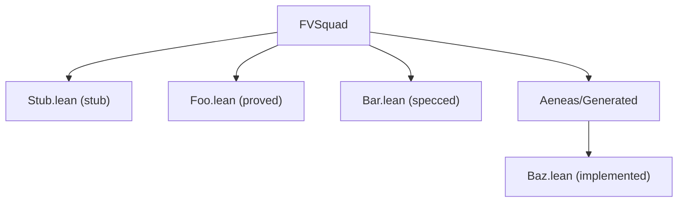

Refresh `formal-verification/REPORT.md` with the sections described below.

## Analysis
{{.PreviousOutputs.analyze}}

## You are the sole writer of `formal-verification/REPORT.md`

Per the Lean Squad cross-workflow contract, only this workflow writes REPORT.md. Other workflows produce their own artefacts (TARGETS.md, RESEARCH.md, CORRESPONDENCE.md, CRITIQUE.md, specs, Lean files, issues, PRs). Your job is to aggregate those into a single dashboard.

## Required sections (in this exact order)

### 1. Disclosure header (top of file, verbatim)

```
> 🔬 This report is maintained by the xylem `lean-squad-report` workflow, part of the Lean Squad formal-verification system (https://github.com/githubnext/agentics/blob/main/docs/lean-squad.md). It is regenerated on each tick; manual edits will be overwritten.
```

### 2. Architecture diagram (mermaid)

Build a mermaid graph of the Lean file tree under `formal-verification/lean/FVSquad/`. Each node label encodes status by scanning that file's contents:

- `specced` — file contains `theorem` or `def` declarations but bodies are `sorry`
- `implemented` — file has non-`sorry` function bodies but theorems are still `sorry`
- `proved` — file has non-`sorry` theorem bodies
- `stub` — file matches the bootstrap stub shape (`Stub.lean` placeholder)

Group by immediate subdirectory (e.g. `FVSquad/`, `FVSquad/Aeneas/Generated/`). Example:



If the `lean/FVSquad/` tree is empty or only contains the stub, emit a one-line placeholder diagram noting no targets yet.

### 3. Target status table

Read `formal-verification/TARGETS.md` and translate each target row into a single line in this table:

```
| Target | Informal spec | Formal spec | Impl extracted | Proofs | Status |
|---|---|---|---|---|---|
| `<name>` | ✅ / ⏳ / — | ✅ / ⏳ / — | ✅ / ⏳ / — | ✅ / ⏳ / — | <word> |
```

Column rules:

- Informal spec: ✅ if `formal-verification/specs/<target>_informal.md` exists, else —.
- Formal spec: ✅ if a `.lean` file for the target exists with non-`sorry` type/signature declarations, ⏳ if the file is present but all-`sorry`, else —.
- Impl extracted: ✅ if the target's function bodies are non-`sorry`, ⏳ if partial, else —.
- Proofs: ✅ if theorem bodies are non-`sorry`, ⏳ if some are, else —.
- Status: one word — `proved` / `implemented` / `specced` / `informal` / `pending` / `blocked`.

Keep to one screen. If there are more than ~20 targets, truncate and note the overflow count.

### 4. Findings summary

Fetch open issues labelled `[Lean Squad]` AND `[finding]` via:

```bash
gh issue list --label "Lean Squad" --label "finding" --state open --limit 50 --json number,title,labels,url
```

(Substitute `--label "[Lean Squad]"` / `--label "[finding]"` or whatever label shape this repo actually uses — try both the bracketed and unbracketed forms and pick the one that returns results; if both return empty, note "no open findings".)

Group findings by classification label (e.g. `spec-incomplete`, `implementation-buggy`, `proof-technique-gap`). For each group, list issue `#N — title` on its own bullet. Keep to a single section, max ~40 lines.

### 5. Run history (last 10 ticks)

Read `formal-verification/repo-memory.json` and pull the final 10 entries of the `runs[]` array. Render as:

```
| Timestamp | Tasks dispatched | Targets | Vessel IDs |
|---|---|---|---|
| <ts> | <task1>, <task2> | <slug1>, <slug2> | <id1>, <id2> |
```

If `runs[]` has fewer than 10 entries, show everything available. If the file is missing or malformed, render a single row explaining the gap.

### 6. Open Lean Squad PRs and issues

Two bullet lists, one for PRs, one for issues:

```bash
gh pr list --search '"[Lean Squad]" in:title' --state open --limit 50 --json number,title,url,mergeable
gh issue list --search '"[Lean Squad]" in:title' --state open --limit 50 --json number,title,url
```

For each PR, one line: `#N — <title> — <mergeable or checks-status>`. For each issue, one line: `#N — <title>`. Keep each list under ~30 entries; if there are more, truncate and note overflow.

## Rules

1. Only write `formal-verification/REPORT.md`. Do NOT edit TARGETS.md, RESEARCH.md, repo-memory.json, Lean files, or any other artefact — those are owned by sibling workflows.
2. Evidence-based: every status claim must trace to a committed file or live `gh` query. Do not speculate about progress.
3. Single page if possible. Truncate long lists with an explicit overflow count rather than dumping everything.
4. If a required input is missing (e.g. `formal-verification/TARGETS.md` absent), render the section with a "no data" placeholder rather than fabricating entries.
5. Preserve the exact disclosure header text in section 1.

When you finish, summarize the counts that ended up in each section and note any inputs that were missing or malformed.
